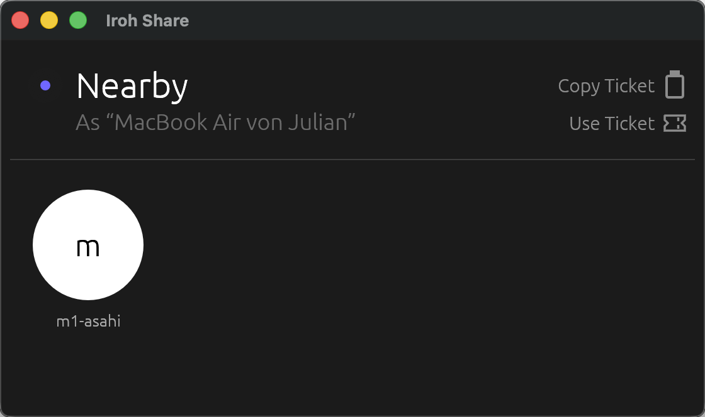
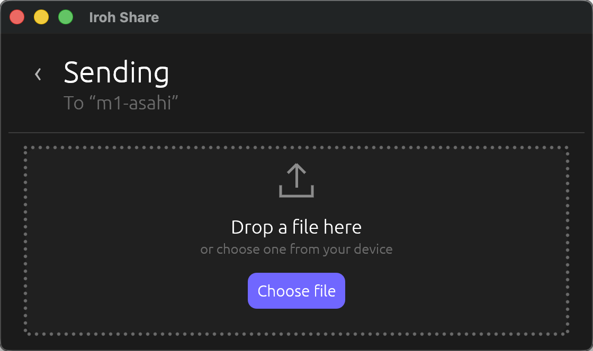

# Iroh Share

Peer-to-peer file sharing for nearby devices, built with Rust,
[Iroh](https://www.iroh.computer/), and [egui](https://www.egui.rs/).

Peer-to-peer file sharing with automatic
[NAT traversal](https://docs.iroh.computer/concepts/nat-traversal) and relay fallback.
The receiver must approve each transfer before anything is written to disk.

## Screenshots

| Nearby devices | Sending a file |
| --- | --- |
|  |  |

## Roadmap

- [x] Nearby device discovery
- [x] Peer-to-peer file transfer
  - [x] Custom protocol for transfer offers and receiver decisions
  - [x] CLI commands
  - [ ] Multiple files per transfer
- [x] Desktop UI
  - [x] Drag and drop
  - [ ] Polish the UI
  - [ ] Transfer progress
- [x] Receiver approval
- [x] Custom download location
- [ ] Discovery beyond the local network
  - [ ] Transfer via numeric code
- [ ] Automated tests
- [ ] Packaged desktop releases
- [ ] Mobile support

## Run

Install [Rust](https://www.rust-lang.org/tools/install), then start the desktop
app on two devices in the same local network:

```bash
cargo run
```

Select a nearby device and choose or drop a file. The receiver can accept or
decline the transfer and select where to save it.

## Platforms

- macOS — tested
- Linux — tested
- Windows — expected to work, not yet tested

### CLI

```bash
cargo run -- send path/to/file
cargo run -- receive
cargo run -- receive path/to/downloads
```

## Architecture

```text
mDNS discovery
      │
      ▼
Sender ── offer ──▶ Receiver
Sender ◀─ decision ─ Receiver
Sender ── blob ───▶ Receiver
```

| Module | Responsibility |
| --- | --- |
| `mdns.rs` | Discovers nearby devices |
| `protocol.rs` | Encodes offers and transfer responses |
| `sender.rs` | Imports and sends files |
| `receiver.rs` | Approves, downloads, and exports files |
| `ui.rs` | Desktop interface |
| `cli.rs` | Terminal interface |

## References

The initial implementation was informed by Iroh's documentation and examples:

- [Write your own protocol](https://docs.iroh.computer/protocols/writing-a-protocol)
- [mDNS address lookup](https://docs.rs/iroh-mdns-address-lookup/latest/iroh_mdns_address_lookup/)
- [Connect two endpoints](https://docs.iroh.computer/connect-two-endpoints)

Minimal experiments based on these resources are kept in [`examples`](examples).

## License

Licensed under the [MIT License](LICENSE).
